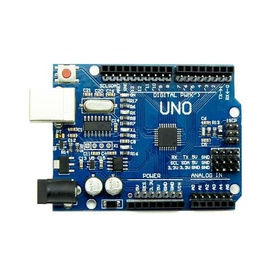
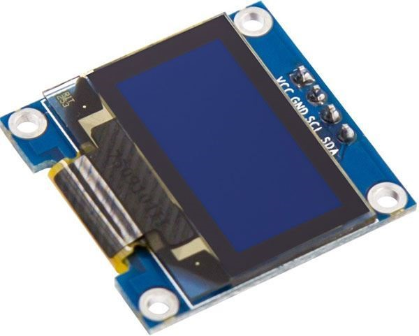

# DE2-Project-Tropical-Plants

## Team members

* Ivan Efimov (responsible for the soil moisture sensor and the air temperature and humidity sensor (DHT12))
* Ivan Pavlov (responsible for the photoresistor and the air temperature and humidity sensor (DHT12))
* Ruslan Oleinik (responsible for the LED strip and the OLED display)
* Anton Panteleev (responsible for the fan and GitHub repository management)

## Hardware description
### 1. Arduino Uno:
* Central controller for processing data from sensors and managing outputs.



### 2. Sensors:
* Soil Moisture Sensor: Measures the moisture level in the soil.


  
* DHT11 Sensor: Measures air temperature and humidity.


  
* Photoresistor: Measures ambient light levels.


### 3. Output Devices:
* OLED Display (I2C interface): Displays real-time sensor readings (e.g., soil moisture, air temperature, humidity, and light levels).


  
* Fan: Operates continuously to simulate airflow.


* LED Strip: Illuminates constantly for lighting purposes.

## Software description

```c
   de2_project         // PlatfomIO project
   ├── include         // Included file(s)
   │   └── timer.h
   ├── lib             // Libraries
   │   ├── twi         // Tomas Fryza's TWI/I2C library
   │   │   ├── twi.c
   │   │   └── twi.h
   │   └── oled        // Sylaina's OLED library
   │       ├── font.h
   │       ├── oled.c
   │       └── oled.h
   ├── src             // Source file(s)
   │   └── main.c
   ├── test            // No need this
   └── platformio.ini  // Project Configuration File
```

## Instructions and photos


This project enables the monitoring and adjustment of critical environmental parameters. Using our system, you can track real-time data on air humidity and temperature, soil moisture, and light levels (in percentages) displayed on an OLED screen. It provides a convenient way to manage and control these values to maintain optimal conditions for your environment.

## References and tools
[AVR course from GitHub of Tomas Fryza](https://github.com/tomas-fryza/avr-course)
