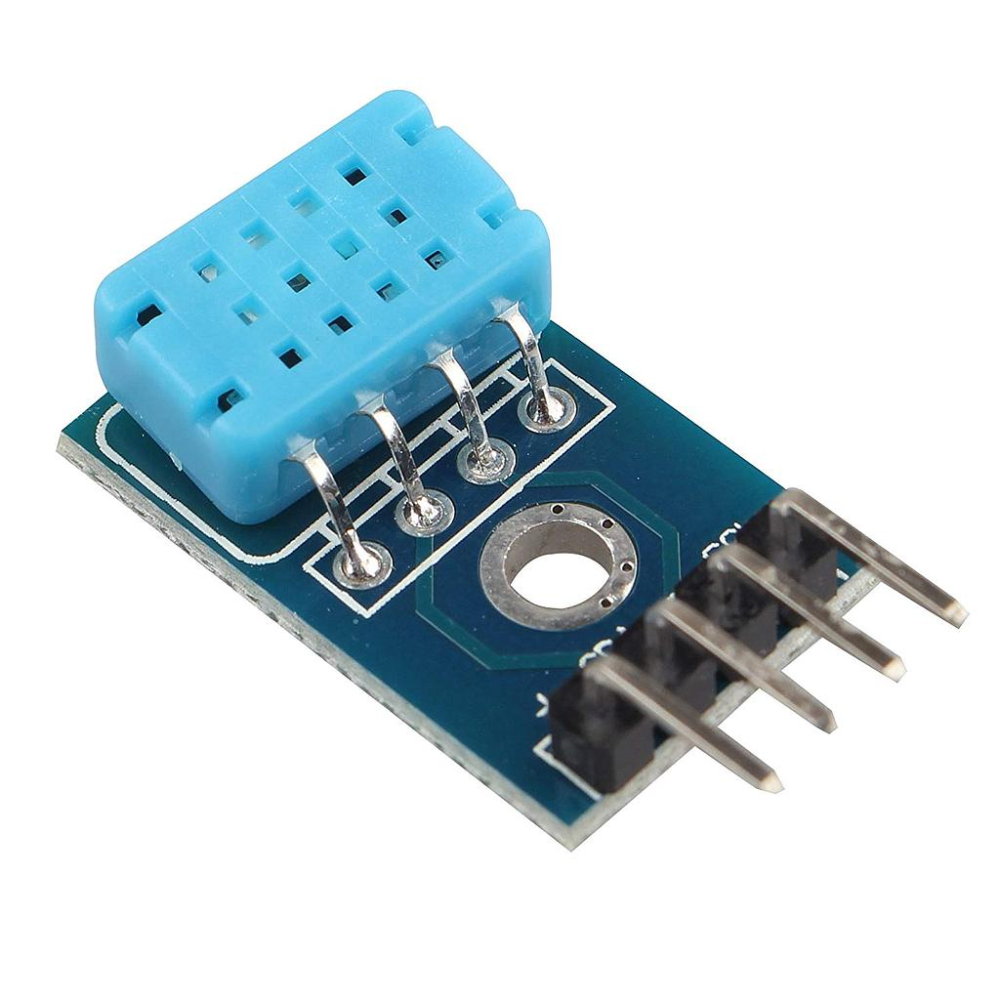
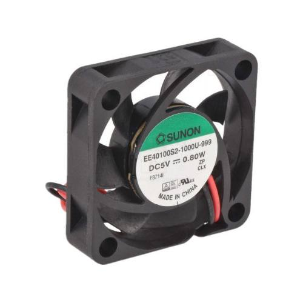
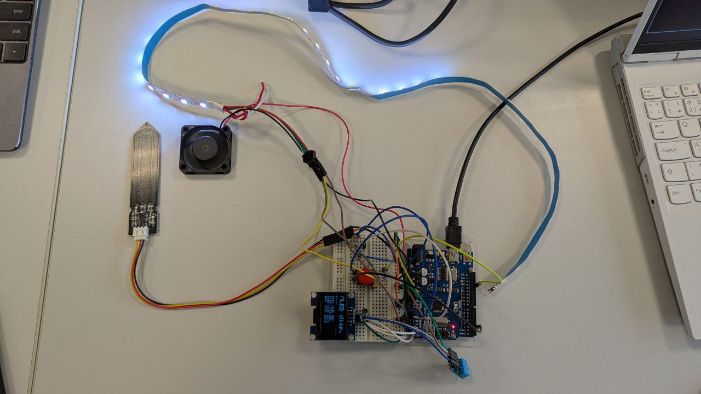

# DE2-Project-Tropical-Plants

## Team members

* Ivan Efimov (responsible for )
* Ivan Pavlov (responsible for )
* Ruslan Oleinik (responsible for )
* Anton Panteleev (responsible for )

## Hardware description
### 1. Arduino Uno:
* Central controller for processing data from sensors and managing outputs.


### 2. Sensors:
* Soil Moisture Sensor: Measures the moisture level in the soil.


  
* DHT11 Sensor: Measures air temperature and humidity.


  
* Photoresistor: Measures ambient light levels.


### 3. Output Devices:
* OLED Display (I2C interface): Displays real-time sensor readings (e.g., soil moisture, air temperature, humidity, and light levels).


  
* Fan: Operates continuously to simulate airflow.



* LED Strip: Illuminates constantly for lighting purposes.

## Software description

```c
   de2_project         // PlatfomIO project
   ├── include         // Included file(s)
   │   └── timer.h
   ├── lib             // Libraries
   │   ├── twi         // Tomas Fryza's TWI/I2C library
   │   │   ├── twi.c
   │   │   └── twi.h
   │   └── oled        // Sylaina's OLED library
   │       ├── font.h
   │       ├── oled.c
   │       └── oled.h
   ├── src             // Source file(s)
   │   └── main.c
   ├── test            // No need this
   └── platformio.ini  // Project Configuration File
```

## Instructions and photos



## References and tools
1. [AVR course from GitHub of Tomas Fryza](https://github.com/tomas-fryza/avr-course)
2. [Datasheet of ATmega328p](https://www.microchip.com/en-us/product/ATmega328p)
3. [OLED with humidity sensor from GitHub of Tomas Fryza](https://github.com/tomas-fryza/avr-course/tree/master/solutions/lab6-i2c-sensor-oled)
4. [Cirkit Designer IDE](https://app.cirkitdesigner.com/)
5. [Draw.io](https://app.diagrams.net)
