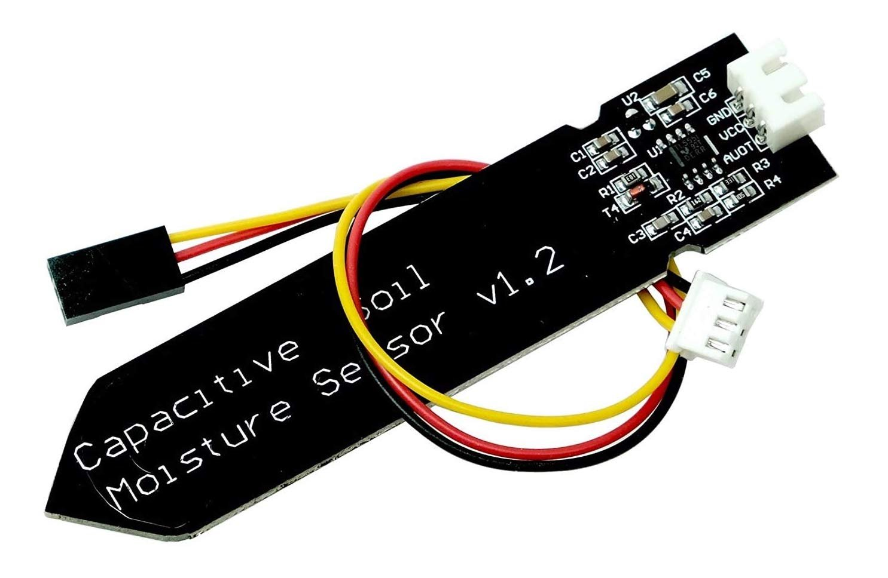

# DE2-Project-Tropical-Plants

## Team members

* Ivan Efimov (responsible for the soil moisture sensor and the air temperature and humidity sensor (DHT12))
* Ivan Pavlov (responsible for the photoresistor and the air temperature and humidity sensor (DHT12))
* Ruslan Oleinik (responsible for the LED strip and the OLED display)
* Anton Panteleev (responsible for the fan and GitHub repository management)

## Hardware description
### 1. Arduino Uno:
* Central controller for processing data from sensors and managing outputs.

### 2. Sensors:
* Soil Moisture Sensor: Measures the moisture level in the soil.

  
* DHT11 Sensor: Measures air temperature and humidity.

  
* Photoresistor: Measures ambient light levels.

### 3. Output Devices:
* OLED Display (I2C interface): Displays real-time sensor readings (e.g., soil moisture, air temperature, humidity, and light levels).

  
* Fan: Operates continuously to simulate airflow.

* LED Strip: Illuminates constantly for lighting purposes.

## Software description

### General Overview
The `main.c` file is designed for an AVR microcontroller and includes functionalities to interact with sensors, an OLED display, and other peripherals. It uses libraries for I2C communication (`twi.h`), an OLED display (`oled.h`), and timer management (`timer.h`). Key functionalities include:

- Reading sensor data (e.g., humidity, temperature, soil moisture, light intensity).
- Controlling LEDs based on sensor inputs.
- Displaying information on an OLED screen.
- Debouncing button inputs.

### Function Descriptions

#### `main()`
The main function serves as the entry point of the program. It initializes peripherals, configures I/O pins, and runs the main loop where sensor data is read, processed, and displayed. Key steps include:

1. **Initialization:**
   - Configures ADC for reading analog sensors.
   - Sets up I2C communication for sensors and the OLED display.
   - Initializes the OLED display and clears the screen.

2. **Infinite Loop:**
   - Continuously reads data from sensors.
   - Calculates derived values (e.g., normalized light levels).
   - Updates the OLED display with sensor readings.
   - Toggles LEDs or performs other actions based on input states.

#### `read_humidity()`
Reads the humidity data from a connected DHT sensor via I2C. It accesses specific memory registers defined in the `DHT_HUM_MEM` macro.

- **Input:** None.
- **Output:** Returns the humidity as a percentage.
- **Key Logic:** Implements error handling for I2C communication.

#### `read_temperature()`
Reads the temperature data from the DHT sensor.

- **Input:** None.
- **Output:** Returns the temperature in Celsius.
- **Key Logic:** Uses I2C to fetch temperature data from the `DHT_TEMP_MEM` register.

#### `read_soil_moisture()`
Reads the soil moisture level using ADC on a specified channel.

- **Input:** None.
- **Output:** Returns a raw ADC value representing soil moisture.
- **Key Logic:** Selects the ADC channel defined in `ADC_CHANNEL_SOIL`.

#### `read_light_intensity()`
Reads the light intensity using ADC.

- **Input:** None.
- **Output:** Returns a normalized light intensity value between `ADC_LIGHT_MIN` and `ADC_LIGHT_MAX`.
- **Key Logic:** Maps raw ADC readings to a normalized scale.

#### `debounce_button()`
Handles button debouncing to ensure stable input detection.

- **Input:** Current button state.
- **Output:** Stabilized button state (pressed or not).
- **Key Logic:** Implements a delay (`DEBOUNCE_DELAY`) to avoid false triggers.

#### `update_oled_display()`
Updates the OLED display with sensor readings and system status.

- **Input:** Sensor data (e.g., temperature, humidity).
- **Output:** Updates the OLED screen with formatted text.
- **Key Logic:** Uses the OLED library to position and print text.

#### `control_led()`
Controls an LED strip based on environmental conditions.

- **Input:** Sensor thresholds (e.g., light or moisture levels).
- **Output:** Adjusts LED state (on/off or brightness).
- **Key Logic:** Uses the `LED_PIN` macro to address the appropriate output pin.

## Instructions and photos

This project enables the monitoring and adjustment of critical environmental parameters. Using our system, you can track real-time data on air humidity and temperature, soil moisture, and light levels (in percentages) displayed on an OLED screen. It provides a convenient way to manage and control these values to maintain optimal conditions for your environment.

## References and tools
* [AVR course from GitHub of Tomas Fryza](https://github.com/tomas-fryza/avr-course)
* [Presentation](https://docs.google.com/presentation/d/1m8dk5Qir-ttnZAApGQMRKTa7_P3oZ743/edit?usp=sharing&ouid=112709814871286802284&rtpof=true&sd=true)

